<h1>Application angular de gestion des produits</h1>
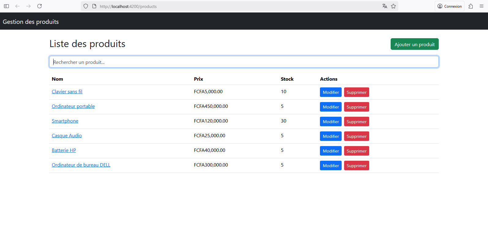
<h3>
Ce projet est une application web complète de gestion de produits développée avec Angular. C'est un projet d'apprentissage du framework Angular dans sa version 19. Il couvre l'ensemble des étapes de la création d'une application, de la configuration initiale au déploiement d'une structure fonctionnelle et maintenable.
L'application utilise Bootstrap 5 pour un design moderne et responsive, et simule un backend avec un service Angular sans avoir besoin d'une API externe.
</h3>
<h3>1. Création du projet Angular</h3>
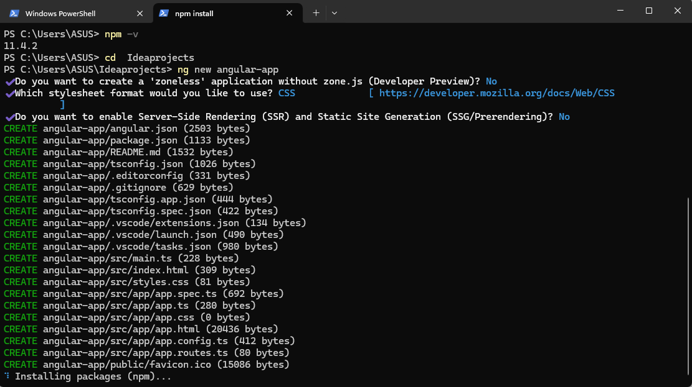
 
<h4>Structure du projet</h4>
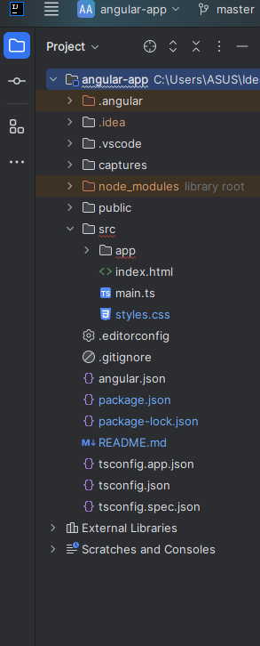
 
<h3>2. Test de lancement de l'application avec " ng serve "</h3>
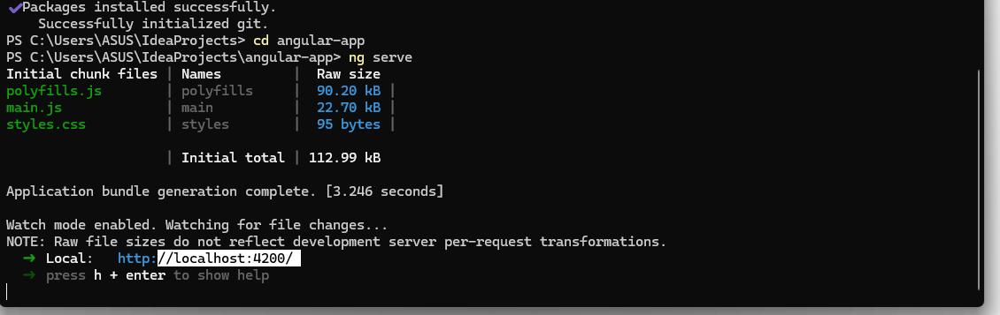
<h3>3. Création du composant product-list.component</h3>
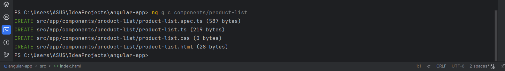
<ul>
<li>product-list.component.ts</li>
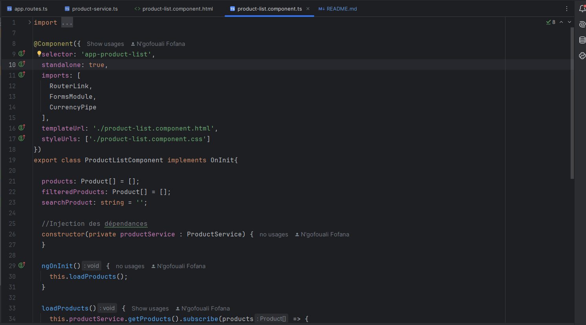
<li>product-list.component.html</li>
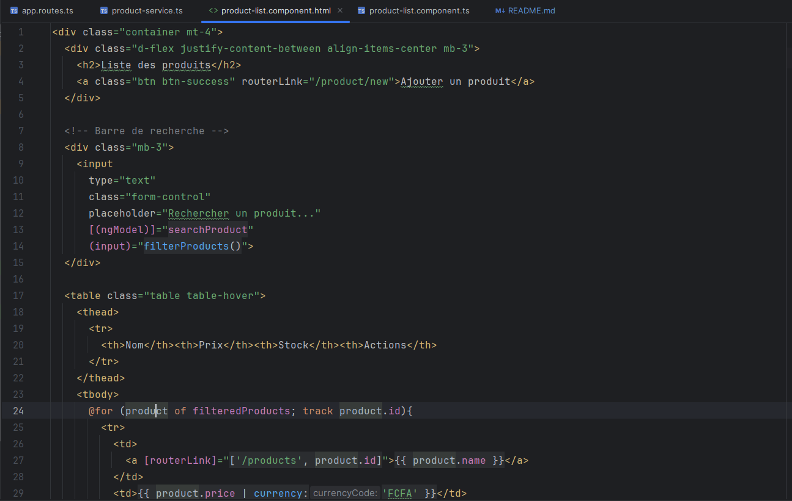
</ul>
 
<h3>4. Création du composant product-form.component</h3>
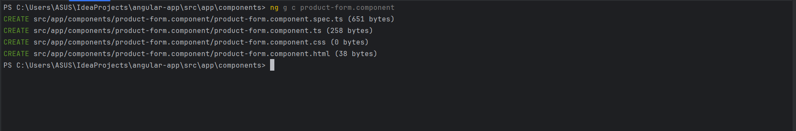
 
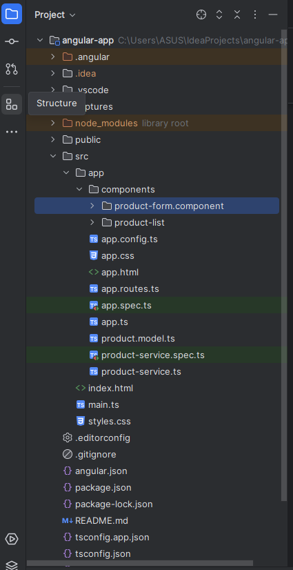
<ul>
<li>product-form.component.ts</li>
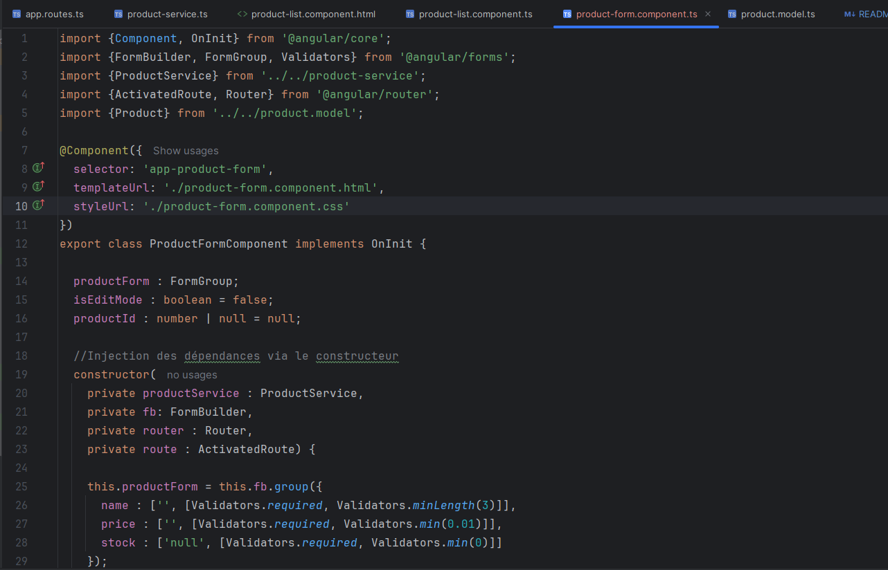
 
<li>product-form.component.html</li>
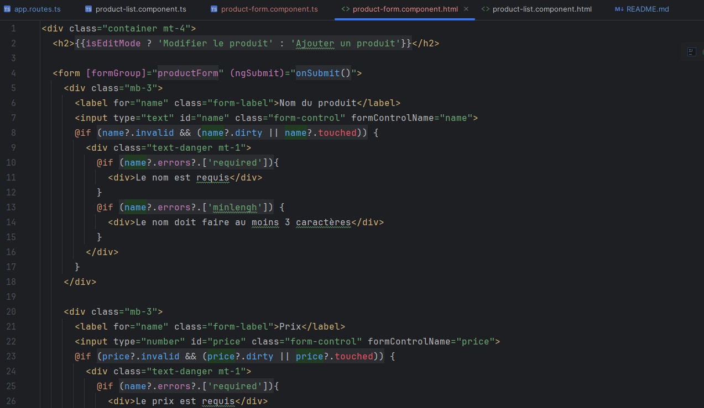
</ul>
 
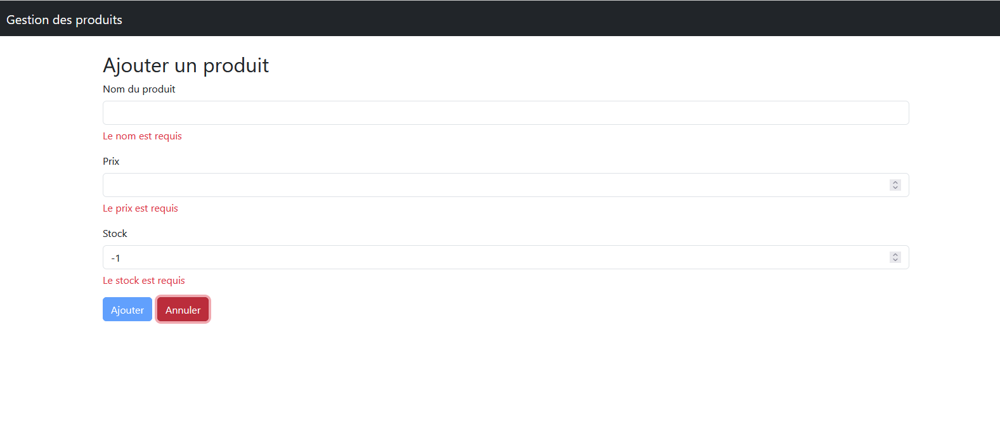
